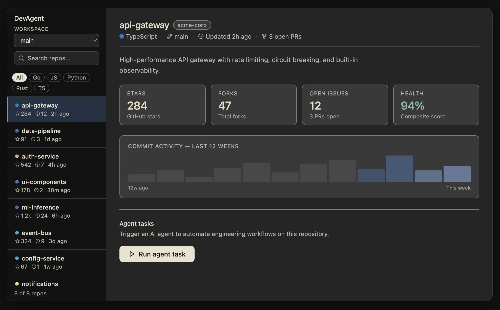
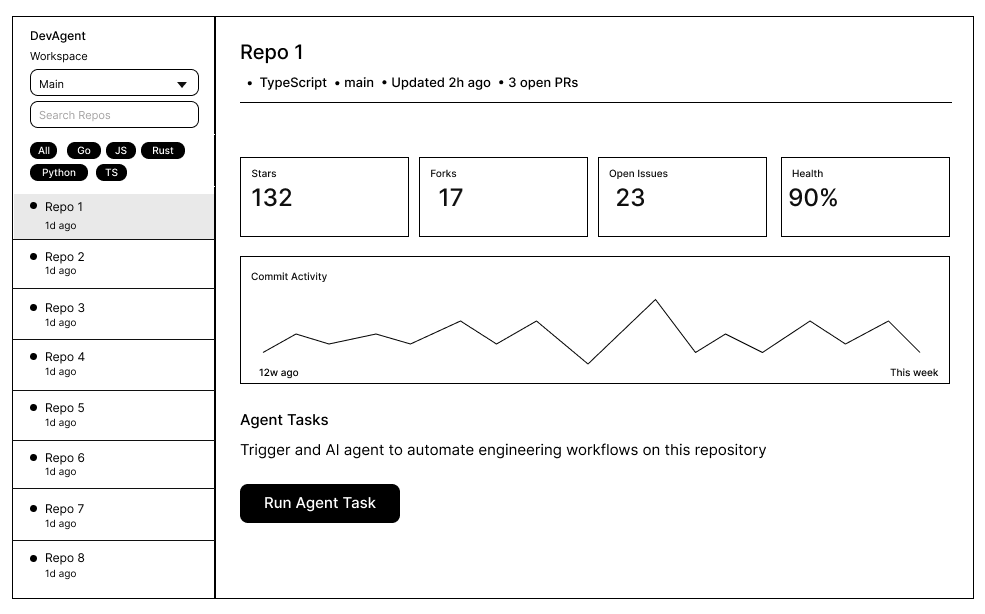
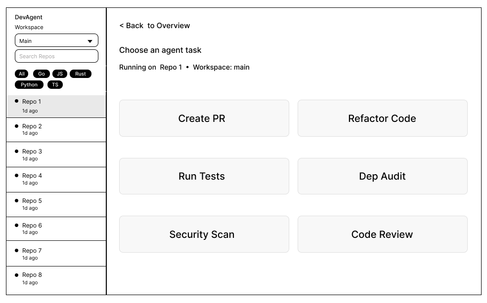
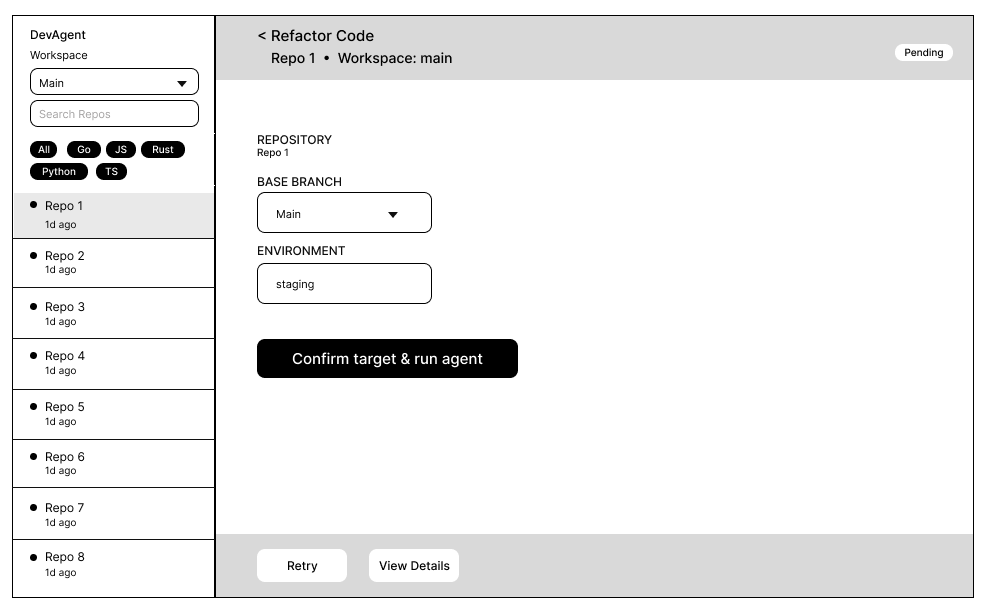
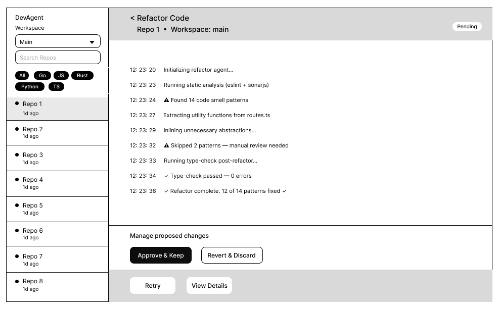

# devagent



Prototype UI for the Dev Agent task flow (repo sidebar, task picker, mock agent run, and details modal). Everything runs in the browser; there is no backend.

### UX rationale: step-driven flows, control, and recovery

Automation in a developer portal is only acceptable if the person using it can always answer: *Where am I? What did I start? How do I leave? What did the system change?* The DevAgent slice is intentionally **step-driven** so those questions stay easy. **Repository overview** is a deliberate pause: the user confirms context (which repo, what it looks like) before any agent work is offered. **Task selection** is a second pause: the user chooses *what* will run, separate from *watching* it run. Only then does the UI move to **execution**. Each step maps to one primary intent: browse, choose, monitor. **Back** and sidebar navigation provide predictability. 

That same structure is what makes **backing out** feel natural rather than heroic. Early steps cost almost nothing to reverse: returning to the overview or picking another repo should clear or orphan an in-flight run so the UI never implies “you must finish this agent job to use the rest of the portal.” Later, when the agent has created branches, PRs, or comments, the product must **surface artifacts explicitly** (links, IDs, “what we changed”) and steer users to **revert in the host**: close the PR, delete the branch, revert the merge, etc. The portal stays honest about what succeeded versus what still needs human cleanup.

**Separating task-oriented actions from monitoring** keeps control and comprehension aligned. In the execution view, **actions** (go back, retry, open details, cancel when available) belong in a stable **header and footer** (or equivalent chrome) tied to the *task*: identity of the repo, task name, status, and outcome. The **log stream** is for *observation*: chronological, monospace, scrollable output that the user reads but does not use as a button bar. Mixing primary controls into the log trains people to hunt for affordances inside noise and blurs “I am driving” versus “I am watching.” Keeping actions outside the log also reinforces that logs are **evidence**, not the workflow itself; the user can open **Details** for a full transcript without conflating navigation with log lines.

**When the result is not satisfactory**, the UX should support three layers of response, all user-led. First, **while the run is active**: stop or cancel when safe, with copy that states what may already have been pushed or opened. Second, **when the run finishes but the outcome is wrong**: treat success in the portal as “the agent completed its script,” not “the business accepts this change”. Link to diffs, PRs, or reports and make **discard / close / revert** paths obvious. Third, **when the user wants another attempt**: **Retry** after fixing inputs or environment, without forcing them through the entire funnel again unless scope changed. None of these replace code review or Git policy; they ensure the portal never implies that “green in the UI” overrides team process.

**Overall, the flow stays under the user’s control** by avoiding surprise automation, trapping navigation, or hidden side effects. Scope is visible before execution; status is visible during execution; artifacts are visible after execution. The agent proposes and executes only along paths the user explicitly started; the user always retains the next move—leave, retry, or clean up in the systems of record. That balance is what makes an AI-native portal feel like a **tool** developers own, not a process that owns them.









## Local development

### Prerequisites

- **Node.js** 18 or newer (20 LTS recommended)
- **npm** 9+ (ships with recent Node installers)

Check versions:

```bash
node -v
npm -v
```

### Run locally

From this directory (`devagent`):

1. Install dependencies:

   ```bash
   npm install
   ```

2. Start the Vite dev server (hot reload):

   ```bash
   npm run dev
   ```

3. Open the URL Vite prints (usually `http://localhost:5173`) in your browser.

### Other scripts

| Command        | Purpose                                      |
| -------------- | -------------------------------------------- |
| `npm run build` | Typecheck and production build to `dist/`   |
| `npm run preview` | Serve the production build locally for smoke testing |

No environment variables or API keys are required for local development.
